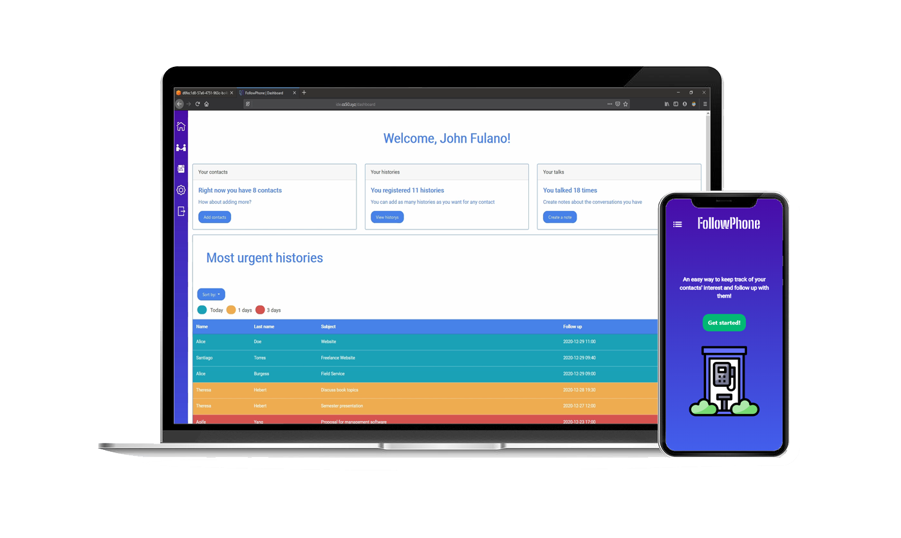

# FollowPhone - CS50X 2020 Final Project

  

This web application helps you keep track of conversation you have with anyone, them being business partners or your friends.

View the [demo application](https://followphone.herokuapp.com/) live!

## Notice for CS50 students

As per [Academic Honesty](https://cs50.harvard.edu/x/2022/honesty/) guidelines, you are **not allowed** to base your projects on this one. The goal of this repository is to show the skills I've learned during CS50's course for professional purposes and future employers. Thereby I assume that:

- You have finished the course to be here.
- If not, don't access any content from this repository.
- I don't take any responsibility for how you use this repository. 

This repository and its content must not be shared without the author's authorization for CS50 students or for those who will take the course in the future. Once again I ask that you act with honesty and ethics, in special if you are a CS50 student or pretend to take the course in the future.

## How to use

- Create an **account**
- Add as many **contacts** as you want
- Follow up with any conversation / business you have with them by creating **histories**
- You can add **notes** for each conversation you have
- Keep track of the most urgent conversations in your **dashboard** and quickly view who needs a reply!

After adding your first history, the dashboard will show the most urgent conversations (histories) first. **You can change** the time of **dashboard alerts** in your profile, as well as your **password** too.

## Motivation

One of the things I've worked involved following up with customers and business partners and provide assistance and support. I thought it would be useful to create my own tool with exclusive features as my first complete web application ever!

This project is my final submission to [Harvard CS50's Introduction to Computer Science](https://www.edx.org/course/introduction-computer-science-harvardx-cs50x) course on edX, resulting in a verified certificate, expanding my perspective about programming and opening my eyes about how computers and systems work.

I'm grateful for the Harvard and edX staff to make this course available for everyone!

## Running the project locally (Linux or WSL required)

1. Clone or download project
2. (Optional) Create and activate virtual environment

        python -m venv venv
        source venv/bin/activate

3. Install project dependencies

        pip install -r requirements.txt

4. Set environment variable to tell Flask which is the application file and start server

        export FLASK_APP=application
        flask run

5. Access `localhost:5500` (or any other link the terminal gives you) on your browser

[See how to use](#how-to-use)

## Libraries and technologies used

- [CS50 IDE](https://cs50.harvard.edu/x/) as development environment (switched to VS Code)
- [Heroku](https://www.heroku.com/) as cloud platform for hosting, fast and easy deploy
- [Flask](https://flask.palletsprojects.com/en/1.1.x/) for the app's backend
- [Flask-SQLAlchemy](https://flask-sqlalchemy.palletsprojects.com/en/2.x/) for database communication
- [Jinja](https://palletsprojects.com/p/jinja/) as the template engine
- [SQLite](https://www.sqlite.org/) as the database
- [Bootstrap](https://getbootstrap.com/) for the frontend UI and responsiveness (with some custom CSS media queries)
- [Day.js](https://day.js.org/) for client-side date and time
- [Cleave.js](https://nosir.github.io/cleave.js/) for input auto formatting

## Useful links

[Gallery of CS50's final projects](https://cs50.harvard.edu/x/2022/gallery) **(type FollowPhone to find my presentation video)**  
[FollowPhone Website](https://followphone.herokuapp.com)  
[LinkedIn](https://www.linkedin.com/in/laurence-zanotti/)  
[pt-BR version of this README (in progress)](#followphone---cs50x2020-final-project)
